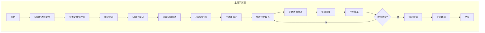
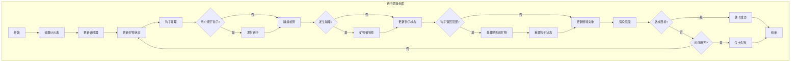
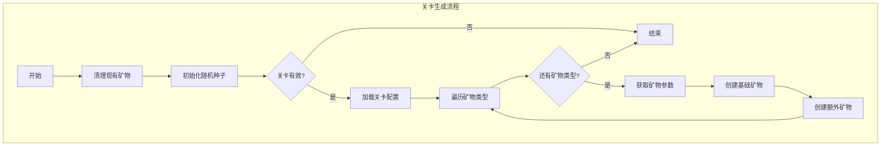
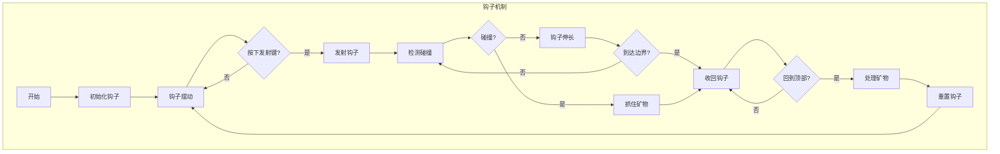
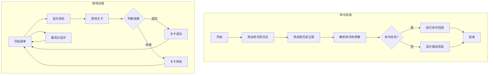
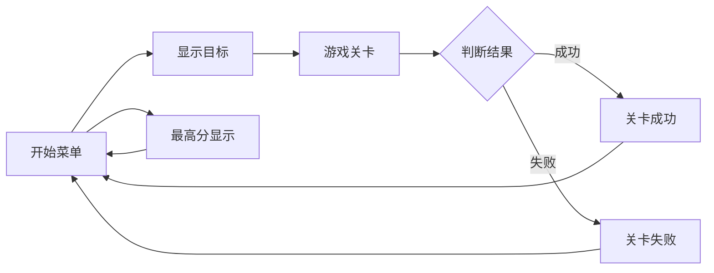

# 黄金矿工 (Gold Miner)

北京工业大学  
马伯龙

## 整体架构

## 技术难度

## 代码可拓展性

## 控制台交互框架

```mermaid

flowchart TB
    subgraph 主程序流程
    A[开始] --> B[初始化游戏命令]
    B --> C[设置矿物管理器]
    C --> D[加载资源]
    D --> E[初始化窗口]
    E --> F[设置初始状态]
    F --> G[启动计时器]
    G --> H[主游戏循环]
    H --> I[处理用户输入]
    I --> J[更新游戏状态]
    J --> K[渲染画面]
    K --> L[控制帧率]
    L --> M{游戏结束?}
    M -->|否| I
    M -->|是| N[清理资源]
    N --> O[关闭环境]
    O --> P[结束]
    end
```

```mermaid
flowchart TB
    subgraph 钩子逻辑处理
    A1[开始] --> B1[设置UI元素]
    B1 --> C1[更新计时器]
    C1 --> D1[更新矿物状态]
    D1 --> E1[钩子处理]
    
    E1 --> F1{用户按下钩子?}
    F1 -->|是| G1[发射钩子]
    F1 -->|否| H1[碰撞检测]
    G1 --> H1
    
    H1 --> I1{发生碰撞?}
    I1 -->|是| J1[矿物被钩住]
    I1 -->|否| K1[更新钩子状态]
    J1 --> K1
    
    K1 --> L1{钩子返回顶部?}
    L1 -->|是| M1[处理抓到的矿物]
    L1 -->|否| O1[更新游戏对象]
    M1 --> N1[重置钩子状态]
    
    N1 --> O1
    O1 --> P1[渲染画面]
    P1 --> Q1{达成目标?}
    Q1 -->|是| R1[关卡成功]
    
    Q1 -->|否| S1{时间用完?}
    S1 -->|是| T1[关卡失败]
    S1 -->|否| D1
    R1 --> U1[结束]
    T1 --> U1
    end
```

```mermaid
flowchart TB
    subgraph 关卡生成流程
    A2[开始] --> B2[清理现有矿物]
    B2 --> C2[初始化随机种子]
    C2 --> D2{关卡有效?}
    D2 -->|否| Z2[结束]
    
    D2 -->|是| E2[加载关卡配置]
    E2 --> F2[遍历矿物类型]
    F2 --> G2{还有矿物类型?}
    G2 -->|否| Z2
    
    G2 -->|是| H2[获取矿物参数]
    H2 --> I2[创建基础矿物]
    I2 --> J2[创建额外矿物]
    J2 --> F2
    end
```

```mermaid
flowchart TB
    subgraph 钩子机制
    A3[开始] --> B3[初始化钩子]
    B3 --> C3[钩子摆动]
    C3 --> D3{按下发射键?}
    D3 -->|否| C3
    
    D3 -->|是| E3[发射钩子]
    E3 --> F3[检测碰撞]
    F3 --> G3{碰撞?}
    G3 -->|否| H3[钩子伸长]
    
    G3 -->|是| I3[抓住矿物]
    H3 --> J3{到达边界?}
    J3 -->|否| F3
    J3 -->|是| K3[收回钩子]
    
    I3 --> K3
    K3 --> L3{回到顶部?}
    L3 -->|否| K3
    L3 -->|是| M3[处理矿物]
    
    M3 --> N3[重置钩子]
    N3 --> C3
    end
```

```mermaid

flowchart TB
    subgraph 命令系统
    A4[开始] --> B4[添加命令到日志]
    B4 --> C4[添加到历史记录]
    C4 --> D4[解析命令和参数]
    
    D4 --> E4{命令存在?}
    E4 -->|是| F4[执行命令回调]
    E4 -->|否| G4[显示错误信息]
    F4 --> H4[结束]
    G4 --> H4
    end
    
    subgraph 游戏流程
    A5[开始菜单] --> B5[显示目标]
    B5 --> C5[游戏关卡]
    C5 --> D5{判断结果}
    
    D5 -->|成功| E5[关卡成功]
    D5 -->|失败| F5[关卡失败]
    E5 --> A5
    F5 --> A5
    
    A5 --> G5[最高分显示]
    G5 --> A5
    end
```

```mermaid
flowchart LR
    A[开始菜单] --> B[显示目标]
    B --> C[游戏关卡]
    C --> D{判断结果}
    D -->|成功| E[关卡成功]
    D -->|失败| F[关卡失败]
    E --> A
    F --> A
    A --> G[最高分显示]
    G --> A
```